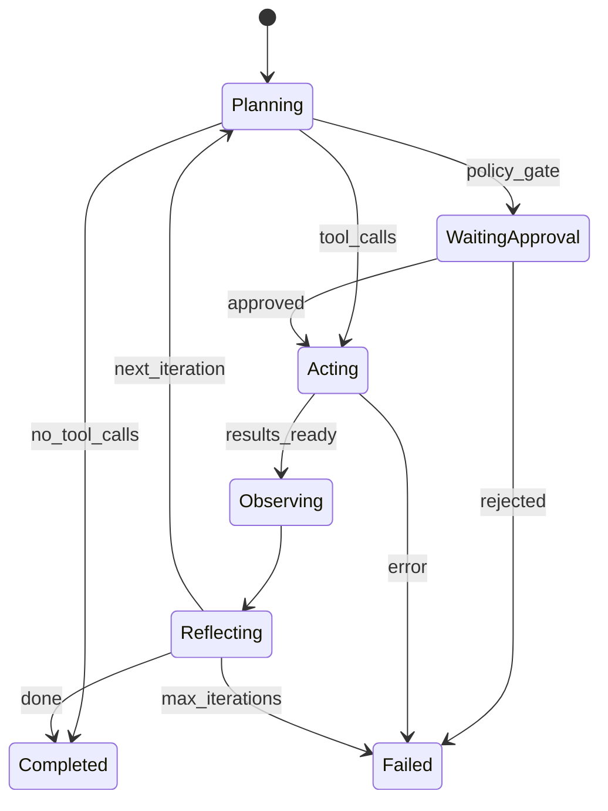

# Your First Agent

## Agent Lifecycle

Every agent executes this loop:



## Python API

```python
import asyncio
from autonomy_loops import Agent, Config
from autonomy_loops._factory import create_provider
from autonomy_loops.tools import ToolRegistry, Tool

# 1. Load config
config = Config.load()

# 2. Create provider
provider = create_provider("anthropic", config)

# 3. Register custom tools
tools = ToolRegistry()
tools.register(Tool(
    name="read_file",
    description="Read a file from the filesystem",
    parameters={
        "type": "object",
        "properties": {"path": {"type": "string"}},
        "required": ["path"],
    },
    handler=lambda path: open(path).read(),
))

# 4. Create and run agent
async def main():
    agent = Agent(
        role="developer",
        mode="code",
        provider=provider,
        config=config,
        tools=tools,
    )
    
    result = await agent.run(
        "Read main.py and add error handling to the database connection",
        context={"project": "my-service"},
    )
    
    print(f"Success: {result.success}")
    print(f"Iterations: {result.iterations}")
    print(f"Tokens used: {result.total_tokens}")
    print(f"Output:\n{result.output}")

asyncio.run(main())
```

## Roles Control Behavior

The role determines *how* the agent thinks:

```bash
# Same task, different roles → different approaches
autonomy-loops run --role developer --task "Review auth module"   # Writes code fixes
autonomy-loops run --role reviewer --task "Review auth module"    # Produces review findings
autonomy-loops run --role security --task "Review auth module"    # Focuses on vulnerabilities
autonomy-loops run --role architect --task "Review auth module"   # Evaluates design decisions
```

## Modes Control Focus

The mode determines *what phase* the agent operates in:

```bash
# Same role, different modes → different outputs
autonomy-loops run --role developer --mode requirements --task "Auth system"  # Requirements
autonomy-loops run --role developer --mode design --task "Auth system"        # Architecture
autonomy-loops run --role developer --mode code --task "Auth system"          # Implementation
autonomy-loops run --role developer --mode test --task "Auth system"          # Test cases
```
