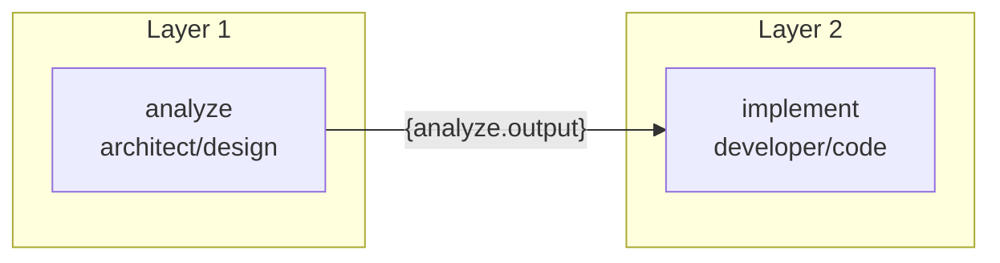

# Your First Pipeline

Pipelines coordinate multiple agents in a DAG (Directed Acyclic Graph). Agents in the same layer run in parallel; dependent agents wait for their prerequisites.

## Pipeline YAML Format

```yaml
# my-pipeline.yaml
name: my-first-pipeline
description: A simple two-agent workflow

steps:
  - name: analyze
    role: architect
    mode: design
    task: "Analyze the codebase structure and identify the main components."
    tools: [file, shell]

  - name: implement
    role: developer
    mode: code
    task: "Based on the analysis: {analyze.output}, implement the requested changes."
    depends_on: [analyze]
    tools: [file, shell]
    max_iterations: 20
```

## Running a Pipeline

=== "CLI"

    ```bash
    autonomy-loops orchestrate --pipeline my-pipeline.yaml
    ```

=== "Python"

    ```python
    from autonomy_loops import Orchestrator, Config
    from autonomy_loops._factory import create_all_providers

    config = Config.load()
    providers = create_all_providers(config)

    orch = Orchestrator.from_pipeline(
        "my-pipeline.yaml",
        config=config,
        providers=providers,
    )

    result = await orch.run(context={"feature": "user auth"})
    
    for step_name, step_result in result.steps.items():
        print(f"{step_name}: {'✓' if step_result.success else '✗'}")
    ```

## Execution Flow



## Variable Interpolation

Use `{step_name.output}` to pass results between steps:

```yaml
steps:
  - name: requirements
    task: "Write requirements for: {context.feature_description}"
    
  - name: design
    task: "Design implementation for: {requirements.output}"
    depends_on: [requirements]
    
  - name: code
    task: "Implement: {design.output}"
    depends_on: [design]
```

## Parallel Execution

Steps without dependencies on each other run in parallel:

```yaml
steps:
  - name: analyze
    task: "Analyze changes"

  - name: security-review
    task: "Security review based on: {analyze.output}"
    depends_on: [analyze]

  - name: code-review       # ← Runs in PARALLEL with security-review
    task: "Code review based on: {analyze.output}"
    depends_on: [analyze]

  - name: synthesize
    task: "Combine: {security-review.output} and {code-review.output}"
    depends_on: [security-review, code-review]
```

## Built-in Pipelines

AutonomyLoops ships with pre-built pipelines in `pipelines/`:

| Pipeline | Description |
|---|---|
| `ci-review.yaml` | Multi-agent code review (architect → security + reviewer → synthesize) |
| `feature-build.yaml` | Full feature development (requirements → design → code → test) |
| `incident-response.yaml` | Incident triage (triage → root cause → fix → postmortem) |
