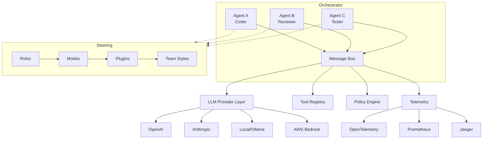

# AutonomyLoops

<div class="grid cards" markdown>

-   :material-rocket-launch:{ .lg .middle } **Get Started in 5 Minutes**

    ---

    Install AutonomyLoops, configure your provider, and run your first agent.

    [:octicons-arrow-right-24: Quick Start](getting-started/quickstart.md)

-   :material-cogs:{ .lg .middle } **Multi-Agent Orchestration**

    ---

    Coordinate multiple agents in pipelines with dependency resolution and parallel execution.

    [:octicons-arrow-right-24: Orchestrator](concepts/orchestrator.md)

-   :material-shield-check:{ .lg .middle } **Enterprise Governance**

    ---

    Policy engine, HITL gates, RBAC, cost guards, and full audit trails.

    [:octicons-arrow-right-24: Policy Engine](concepts/policy-engine.md)

-   :material-factory:{ .lg .middle } **Industry Plugins**

    ---

    Domain expertise for FinTech, Cloud Native, Embedded, Networking, and Data Engineering.

    [:octicons-arrow-right-24: Plugins](plugins/index.md)

</div>

---

## What is AutonomyLoops?

**AutonomyLoops** is a production-ready framework for deploying, steering, and governing autonomous AI agents at scale. It provides:

- **Multi-model support** Swap between OpenAI, Anthropic, AWS Bedrock, and local models without code changes
- **Layered steering** Roles, modes, plugins, and team styles shape agent behavior
- **Policy governance** Declarative rules with human-in-the-loop approval gates
- **Full observability** OpenTelemetry tracing, structured logging, Prometheus metrics
- **Enterprise security** RBAC, secret vaults, sandboxed tool execution, audit trails
- **Multi-agent pipelines** Coordinate agents in DAG-based workflows with handoffs

## Architecture



## Quick Example

=== "Python"

    ```python
    import asyncio
    from autonomy_loops import Agent, Config
    from autonomy_loops._factory import create_provider

    async def main():
        config = Config.load()
        provider = create_provider("anthropic", config)
        
        agent = Agent(
            role="developer",
            mode="code",
            provider=provider,
        )
        result = await agent.run("Implement a Redis-backed rate limiter")
        print(result.output)

    asyncio.run(main())
    ```

=== "CLI"

    ```bash
    autonomy-loops run \
      --role developer \
      --mode code \
      --task "Implement a Redis-backed rate limiter"
    ```

=== "Pipeline"

    ```yaml
    # pipelines/my-pipeline.yaml
    name: feature-review
    steps:
      - name: implement
        role: developer
        mode: code
        task: "Implement the feature: {context.description}"
      - name: review
        role: reviewer
        mode: review
        task: "Review: {implement.output}"
        depends_on: [implement]
    ```

## Platform Support

| Platform | Status | Notes |
|---|---|---|
| GitHub Actions | :white_check_mark: Full | CI/CD + Pages |
| GitLab CI/CD | :white_check_mark: Full | CI/CD + Pages |
| Azure DevOps | :white_check_mark: Supported | Pipelines |
| Jenkins | :white_check_mark: Supported | Jenkinsfile |
| Docker / K8s | :white_check_mark: Full | Helm chart available |
| Local Dev | :white_check_mark: Full | pip install + run |

## Language Support

AutonomyLoops auto-detects project languages and loads appropriate steering:

| Language | Detection | Plugin Steering Available |
|---|---|---|
| Python | `.py` | :white_check_mark: |
| TypeScript | `.ts`, `.tsx` | :white_check_mark: |
| Go | `.go` | :white_check_mark: |
| Rust | `.rs` | :white_check_mark: |
| C/C++ | `.c`, `.cpp`, `.h` | :white_check_mark: |
| Java | `.java` | :white_check_mark: |
| Solidity | `.sol` | :white_check_mark: |
| Verilog/SV | `.v`, `.sv` | :white_check_mark: |
| Terraform | `.tf` | :white_check_mark: |
| Kubernetes | `.yaml` (K8s) | :white_check_mark: |
