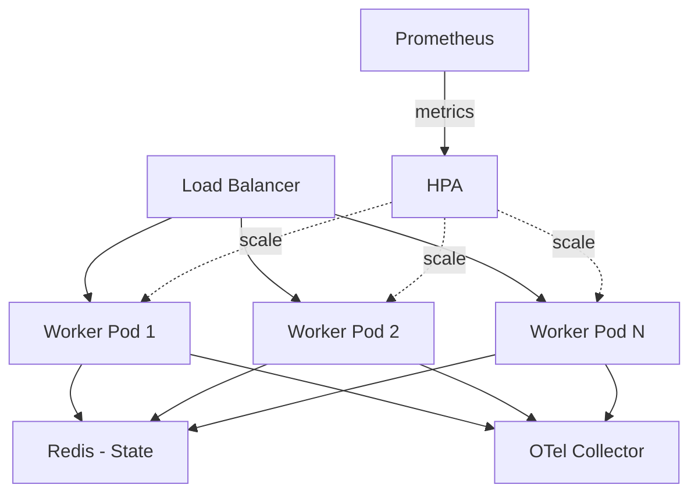

# Container Orchestration

## Docker

### Production Image

```dockerfile
# Dockerfile (included in repo)
FROM python:3.12-slim AS builder
WORKDIR /build
COPY pyproject.toml README.md ./
COPY autonomy_loops/ autonomy_loops/
COPY roles/ modes/ plugins/ pipelines/ ./
RUN pip install --no-cache-dir --prefix=/install .

FROM python:3.12-slim
RUN useradd --create-home agent
WORKDIR /app
COPY --from=builder /install /usr/local
COPY roles/ modes/ plugins/ pipelines/ ./
USER agent
ENTRYPOINT ["autonomy-loops"]
```

### Run

```bash
docker build -t autonomy-loops .

# Single agent task
docker run --rm \
  -e ANTHROPIC_API_KEY=$ANTHROPIC_API_KEY \
  autonomy-loops run --role developer --task "Write a health check endpoint"

# Dashboard
docker run --rm -p 8091:8091 autonomy-loops serve
```

## Kubernetes

### Deployment Manifest

```yaml
# k8s/deployment.yaml
apiVersion: apps/v1
kind: Deployment
metadata:
  name: autonomy-loops-worker
  labels:
    app: autonomy-loops
    component: worker
spec:
  replicas: 3
  selector:
    matchLabels:
      app: autonomy-loops
  template:
    metadata:
      labels:
        app: autonomy-loops
      annotations:
        prometheus.io/scrape: "true"
        prometheus.io/port: "9090"
    spec:
      serviceAccountName: autonomy-loops
      securityContext:
        runAsNonRoot: true
        runAsUser: 1000
      containers:
        - name: agent
          image: ghcr.io/gauravagrawalgarg/autonomy-loops:latest
          args: ["serve", "--port", "8091"]
          ports:
            - containerPort: 8091
              name: http
            - containerPort: 9090
              name: metrics
          env:
            - name: ANTHROPIC_API_KEY
              valueFrom:
                secretKeyRef:
                  name: llm-credentials
                  key: anthropic-api-key
            - name: OTEL_EXPORTER_OTLP_ENDPOINT
              value: "http://otel-collector:4317"
          resources:
            requests:
              cpu: 100m
              memory: 256Mi
            limits:
              cpu: 1000m
              memory: 1Gi
          livenessProbe:
            httpGet:
              path: /health
              port: http
            initialDelaySeconds: 10
          readinessProbe:
            httpGet:
              path: /ready
              port: http
---
apiVersion: v1
kind: Service
metadata:
  name: autonomy-loops
spec:
  selector:
    app: autonomy-loops
  ports:
    - port: 80
      targetPort: http
      name: http
    - port: 9090
      targetPort: metrics
      name: metrics
---
apiVersion: autoscaling/v2
kind: HorizontalPodAutoscaler
metadata:
  name: autonomy-loops
spec:
  scaleTargetRef:
    apiVersion: apps/v1
    kind: Deployment
    name: autonomy-loops-worker
  minReplicas: 2
  maxReplicas: 20
  metrics:
    - type: Pods
      pods:
        metric:
          name: autonomy_active_agents
        target:
          type: AverageValue
          averageValue: 5
```

### Secrets

```yaml
# k8s/secrets.yaml (apply via kubectl or sealed-secrets)
apiVersion: v1
kind: Secret
metadata:
  name: llm-credentials
type: Opaque
stringData:
  anthropic-api-key: "sk-ant-..."
  openai-api-key: "sk-..."
```

## Helm Chart (Values)

```yaml
# charts/autonomy-loops/values.yaml
replicaCount: 3

image:
  repository: ghcr.io/gauravagrawalgarg/autonomy-loops
  tag: latest
  pullPolicy: IfNotPresent

config:
  defaultProvider: anthropic
  maxIterations: 50
  costLimitUsd: 10.0
  telemetryEndpoint: http://otel-collector:4317

secrets:
  existingSecret: llm-credentials

autoscaling:
  enabled: true
  minReplicas: 2
  maxReplicas: 20
  targetActiveAgents: 5

resources:
  requests:
    cpu: 100m
    memory: 256Mi
  limits:
    cpu: 1000m
    memory: 1Gi

serviceMonitor:
  enabled: true
  interval: 15s
```

## Scaling Patterns

### Horizontal: Worker Pool



### Vertical: GPU for Local Models

```yaml
# For local model inference (Ollama/vLLM)
resources:
  limits:
    nvidia.com/gpu: 1
nodeSelector:
  gpu: "true"
```
