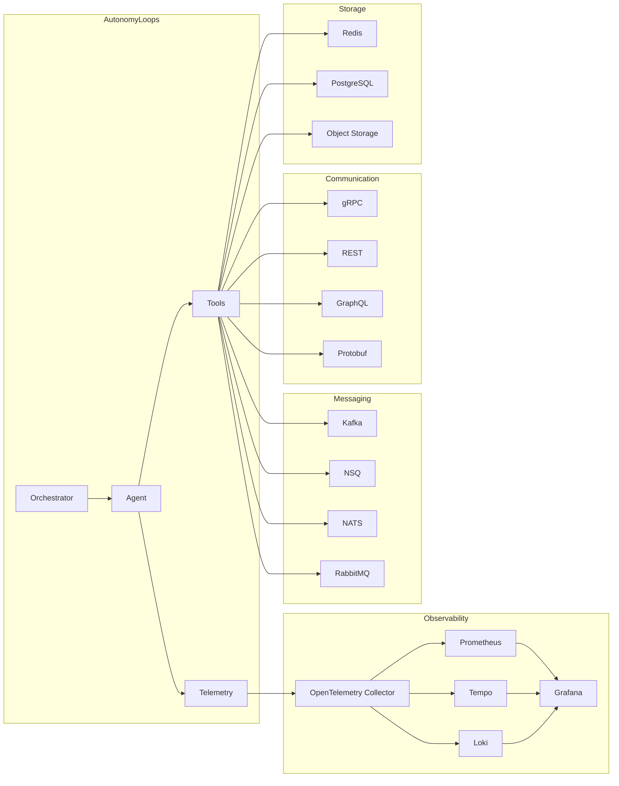

# Integrations

AutonomyLoops is designed to plug into modern infrastructure stacks from silicon-level embedded systems to hyperscale cloud platforms. This section covers integration with industry-standard tooling across the full stack.

## Integration Architecture

## Stack Coverage

| Layer | Technologies | Integration Depth |
|---|---|---|
| **Observability** | OpenTelemetry, Prometheus, Grafana, Tempo, Loki, Jaeger | Native |
| **Messaging** | Kafka, NSQ, NATS, RabbitMQ, Redis Streams, AWS SQS | Tool plugins |
| **Communication** | gRPC, REST, GraphQL, Protobuf, JSON-RPC, WebSocket | Protocol support |
| **Orchestration** | Kubernetes, Docker, Nomad, ECS, Cloud Run | Deployment targets |
| **CI/CD** | GitHub Actions, GitLab CI, Jenkins, ArgoCD, Flux | Pipeline templates |
| **Secrets** | HashiCorp Vault, AWS Secrets Manager, Azure Key Vault | Token vault backends |
| **Databases** | PostgreSQL, Redis, DynamoDB, MongoDB, ClickHouse | Agent state + tools |
| **Search** | Elasticsearch, OpenSearch, Meilisearch, Typesense | Knowledge retrieval |

## Sections

-   :material-chart-line:{ .lg .middle } **Observability Stack**

    ---

    OpenTelemetry, Prometheus, Grafana, Tempo, Loki full observability for agent loops.

    [:octicons-arrow-right-24: Observability](observability.md)

-   :material-message-fast:{ .lg .middle } **Message Queues**

    ---

    Kafka, NSQ, NATS, RabbitMQ async agent communication and event-driven architectures.

    [:octicons-arrow-right-24: Message Queues](message-queues.md)

-   :material-swap-horizontal:{ .lg .middle } **Service Communication**

    ---

    gRPC, Protobuf, REST, GraphQL inter-agent and service-to-agent communication.

    [:octicons-arrow-right-24: Service Communication](service-communication.md)

-   :material-pulse:{ .lg .middle } **Tracing & Metrics**

    ---

    Distributed tracing with Tempo/Jaeger, metrics with Prometheus, dashboards with Grafana.

    [:octicons-arrow-right-24: Tracing & Metrics](tracing-metrics.md)

-   :material-pipe:{ .lg .middle } **CI/CD Platforms**

    ---

    GitHub Actions, GitLab CI, Jenkins run agents in your existing pipelines.

    [:octicons-arrow-right-24: CI/CD](ci-cd.md)

-   :material-docker:{ .lg .middle } **Container Orchestration**

    ---

    Docker, Kubernetes, Helm deploy and scale agent workloads.

    [:octicons-arrow-right-24: Containers](containers.md)

