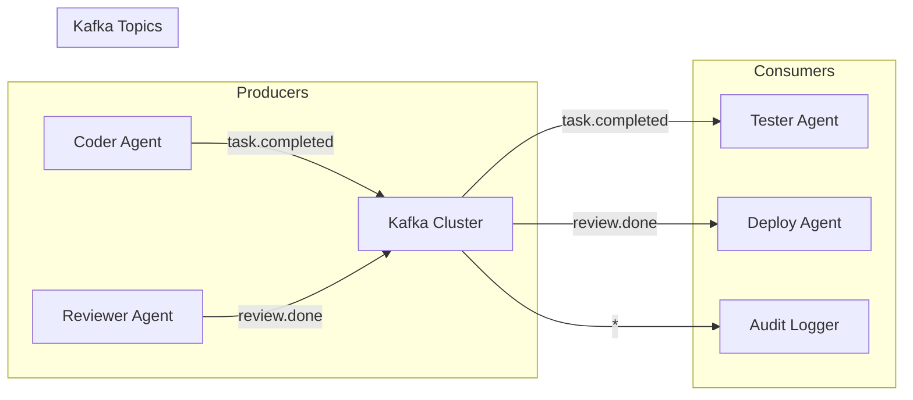
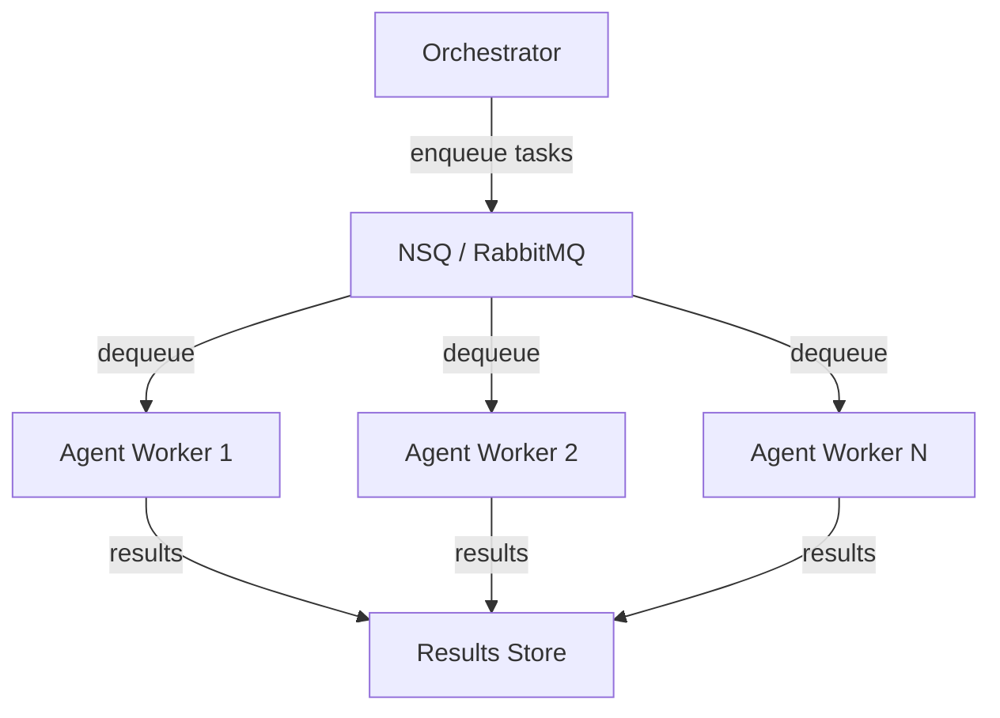

# Message Queues

AutonomyLoops agents can communicate asynchronously through message queues for event-driven architectures, distributed processing, and decoupled agent-to-agent communication.

## When to Use Message Queues

| Pattern | Use Case | Recommended Queue |
|---|---|---|
| Event streaming | Audit logs, activity feeds | Kafka, Redpanda |
| Work distribution | Distribute tasks across agent pool | NSQ, RabbitMQ |
| Request/reply | Inter-agent synchronous communication | NATS |
| Fan-out | Broadcast results to multiple consumers | Kafka, NATS |
| Priority queues | Critical tasks processed first | RabbitMQ |
| Buffering | Smooth bursty workloads | NSQ, SQS |

## Architecture Patterns

### Event-Driven Agent Communication



### Work Queue Distribution



## Kafka Integration

### Producer (Agent Publishes Events)

```python
from confluent_kafka import Producer
import json

class KafkaEventPublisher:
    """Publish agent events to Kafka topics."""
    
    def __init__(self, bootstrap_servers: str = "localhost:9092"):
        self.producer = Producer({
            'bootstrap.servers': bootstrap_servers,
            'client.id': 'autonomy-loops',
            'acks': 'all',
            'retries': 3,
            'compression.type': 'snappy',
        })
    
    def publish_agent_event(self, topic: str, event: dict):
        """Publish an agent lifecycle event."""
        self.producer.produce(
            topic=topic,
            key=event.get("agent_id", "").encode(),
            value=json.dumps(event).encode(),
            headers=[("content-type", b"application/json")],
        )
        self.producer.flush()
```

### Consumer (Agent Listens for Tasks)

```python
from confluent_kafka import Consumer

class KafkaTaskConsumer:
    """Consume tasks from Kafka and dispatch to agents."""
    
    def __init__(self, group_id: str, topics: list[str]):
        self.consumer = Consumer({
            'bootstrap.servers': 'localhost:9092',
            'group.id': group_id,
            'auto.offset.reset': 'earliest',
            'enable.auto.commit': False,
        })
        self.consumer.subscribe(topics)
    
    async def process_messages(self, agent_factory):
        while True:
            msg = self.consumer.poll(timeout=1.0)
            if msg is None:
                continue
            task = json.loads(msg.value())
            agent = agent_factory(task['role'], task['mode'])
            result = await agent.run(task['description'])
            # Commit offset only after successful processing
            self.consumer.commit(msg)
```

## NSQ Integration

NSQ excels at real-time message delivery with no single point of failure.

```python
import nsq
import json

class NSQAgentWorker:
    """NSQ-backed distributed agent worker."""
    
    def __init__(self, topic: str, channel: str, lookupd: str = "localhost:4161"):
        self.reader = nsq.Reader(
            topic=topic,
            channel=channel,
            lookupd_http_addresses=[lookupd],
            message_handler=self._handle_message,
            max_in_flight=5,
        )
    
    async def _handle_message(self, message):
        task = json.loads(message.body)
        try:
            result = await self.process_task(task)
            message.finish()
        except Exception:
            message.requeue(delay=5000)  # Retry in 5s
    
    async def process_task(self, task: dict):
        """Override to implement agent logic."""
        raise NotImplementedError
```

### NSQ Topology for Agent Pools

```
nsqd (1 per host) ─── nsqlookupd (2-3 for HA) ─── nsqadmin (UI)
     │
     ├── topic: agent.tasks.code
     │      └── channel: worker-pool  (competing consumers)
     │      └── channel: audit-log    (all messages for audit)
     │
     └── topic: agent.results
            └── channel: orchestrator (single consumer)
```

## NATS Integration

NATS provides ultra-low-latency pub/sub with request/reply patterns.

```python
import nats

class NATSAgentBus:
    """NATS-based agent communication bus."""
    
    def __init__(self):
        self.nc = None
    
    async def connect(self, servers: str = "nats://localhost:4222"):
        self.nc = await nats.connect(servers)
    
    async def request_agent(self, subject: str, task: dict, timeout: float = 30.0) -> dict:
        """Send a task and wait for response (request/reply pattern)."""
        payload = json.dumps(task).encode()
        response = await self.nc.request(subject, payload, timeout=timeout)
        return json.loads(response.data)
    
    async def subscribe_tasks(self, subject: str, handler):
        """Subscribe to tasks (competing consumer via queue group)."""
        await self.nc.subscribe(
            subject,
            queue="agent-workers",  # Load balancing across subscribers
            cb=handler,
        )
```

## RabbitMQ Integration

Best for complex routing, priority queues, and guaranteed delivery.

```python
import aio_pika

class RabbitMQTaskQueue:
    """RabbitMQ task queue with priority support."""
    
    async def connect(self, url: str = "amqp://localhost"):
        self.connection = await aio_pika.connect_robust(url)
        self.channel = await self.connection.channel()
        await self.channel.set_qos(prefetch_count=1)
    
    async def declare_queue(self, name: str, max_priority: int = 10):
        return await self.channel.declare_queue(
            name,
            durable=True,
            arguments={"x-max-priority": max_priority},
        )
    
    async def publish_task(self, queue: str, task: dict, priority: int = 5):
        await self.channel.default_exchange.publish(
            aio_pika.Message(
                body=json.dumps(task).encode(),
                priority=priority,
                delivery_mode=aio_pika.DeliveryMode.PERSISTENT,
            ),
            routing_key=queue,
        )
```

## Comparison Matrix

| Feature | Kafka | NSQ | NATS | RabbitMQ |
|---|---|---|---|---|
| **Throughput** | Very High | High | Very High | Medium |
| **Latency** | Medium | Low | Very Low | Low |
| **Ordering** | Per-partition | No | No | Per-queue |
| **Replay** | Yes (retention) | No | JetStream | No |
| **Clustering** | Built-in | Built-in | Built-in | Manual |
| **Protocol** | Custom TCP | Custom TCP | Custom TCP | AMQP |
| **Best for** | Event streaming | Work queues | Request/reply | Complex routing |
| **Agent use case** | Audit + events | Task distribution | Inter-agent RPC | Priority tasks |

## Best Practices

!!! tip "Message Queue Selection"

    1. **Kafka** When you need event replay, ordering, and long-term retention (audit trails)
    2. **NSQ** When you need simple, reliable work distribution without Zookeeper complexity
    3. **NATS** When latency matters and you need request/reply patterns between agents
    4. **RabbitMQ** When you need complex routing, priorities, and dead-letter handling
    5. **Redis Streams** When you already have Redis and need lightweight streaming
    6. **AWS SQS** When you're cloud-native and want zero-ops messaging
