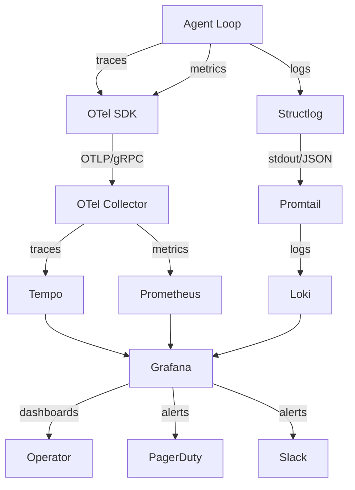

# Observability Stack

AutonomyLoops provides first-class observability through the **LGTM stack** (Loki, Grafana, Tempo, Mimir/Prometheus) and OpenTelemetry as the universal data pipeline.

## Architecture



## Configuration

=== "autonomy-loops.yaml"

    ```yaml
    telemetry:
      enabled: true
      exporter: otlp              # console | otlp | none
      endpoint: http://localhost:4317  # OTel Collector gRPC
      log_level: info
      audit_trail: true
      service_name: autonomy-loops
    ```

=== "Environment Variables"

    ```bash
    export OTEL_SERVICE_NAME=autonomy-loops
    export OTEL_EXPORTER_OTLP_ENDPOINT=http://otel-collector:4317
    export OTEL_EXPORTER_OTLP_PROTOCOL=grpc
    export OTEL_TRACES_SAMPLER=parentbased_traceidalgo
    export OTEL_TRACES_SAMPLER_ARG=0.1  # 10% sampling in prod
    ```

## OpenTelemetry Integration

### Trace Spans

AutonomyLoops automatically creates spans for:

| Operation | Span Name | Attributes |
|---|---|---|
| Agent execution | `agent.run` | `agent.role`, `agent.mode`, `agent.task` |
| LLM call | `llm.complete` | `llm.provider`, `llm.model`, `llm.tokens` |
| Tool execution | `tool.execute` | `tool.name`, `tool.category`, `tool.success` |
| Policy evaluation | `policy.evaluate` | `policy.decision`, `policy.rules_triggered` |
| Pipeline step | `pipeline.step` | `step.name`, `step.role`, `step.depends_on` |

### Custom Instrumentation

```python
from autonomy_loops.telemetry import get_tracer

tracer = get_tracer("my-custom-tool")

async def my_tool(query: str) -> str:
    with tracer.start_as_current_span("my_tool.execute") as span:
        span.set_attribute("query.length", len(query))
        result = await do_work(query)
        span.set_attribute("result.length", len(result))
        return result
```

## Prometheus Metrics

### Built-in Metrics

| Metric | Type | Labels | Description |
|---|---|---|---|
| `autonomy_agent_iterations_total` | Counter | `role`, `mode`, `status` | Total agent loop iterations |
| `autonomy_agent_duration_seconds` | Histogram | `role`, `mode` | Agent execution duration |
| `autonomy_llm_tokens_total` | Counter | `provider`, `model`, `type` | Token consumption |
| `autonomy_llm_requests_total` | Counter | `provider`, `model`, `status` | LLM API calls |
| `autonomy_llm_latency_seconds` | Histogram | `provider`, `model` | LLM response latency |
| `autonomy_tool_calls_total` | Counter | `tool`, `category`, `status` | Tool invocations |
| `autonomy_policy_decisions_total` | Counter | `decision`, `rule` | Policy evaluations |
| `autonomy_pipeline_duration_seconds` | Histogram | `pipeline` | Pipeline execution time |
| `autonomy_cost_usd` | Counter | `provider`, `model` | Estimated cost |

### Prometheus Scrape Config

```yaml
# prometheus.yml
scrape_configs:
  - job_name: autonomy-loops
    scrape_interval: 15s
    static_configs:
      - targets: ['autonomy-loops:9090']
    metrics_path: /metrics
```

## Grafana Dashboards

### Agent Performance Dashboard

```json
{
  "panels": [
    {
      "title": "Agent Success Rate",
      "type": "stat",
      "targets": [{"expr": "rate(autonomy_agent_iterations_total{status='completed'}[5m]) / rate(autonomy_agent_iterations_total[5m])"}]
    },
    {
      "title": "Token Consumption",
      "type": "timeseries",
      "targets": [{"expr": "sum(rate(autonomy_llm_tokens_total[5m])) by (provider, model)"}]
    },
    {
      "title": "LLM Latency (p95)",
      "type": "timeseries",
      "targets": [{"expr": "histogram_quantile(0.95, rate(autonomy_llm_latency_seconds_bucket[5m]))"}]
    },
    {
      "title": "Cost per Hour",
      "type": "stat",
      "targets": [{"expr": "sum(rate(autonomy_cost_usd[1h]))"}]
    }
  ]
}
```

### Recommended Alert Rules

```yaml
# alerting-rules.yml
groups:
  - name: autonomy-loops
    rules:
      - alert: HighAgentFailureRate
        expr: rate(autonomy_agent_iterations_total{status="failed"}[10m]) > 0.1
        for: 5m
        labels:
          severity: warning
        annotations:
          summary: "Agent failure rate above 10%"

      - alert: LLMLatencyHigh
        expr: histogram_quantile(0.95, rate(autonomy_llm_latency_seconds_bucket[5m])) > 30
        for: 5m
        labels:
          severity: critical
        annotations:
          summary: "LLM p95 latency above 30s"

      - alert: CostBudgetExceeded
        expr: sum(autonomy_cost_usd) > 100
        labels:
          severity: warning
        annotations:
          summary: "Daily cost budget exceeded"
```

## Structured Logging (Loki)

AutonomyLoops uses `structlog` for JSON-formatted logs:

```json
{
  "timestamp": "2026-06-27T10:30:00.000Z",
  "level": "info",
  "event": "agent_start",
  "role": "developer",
  "mode": "code",
  "provider": "anthropic",
  "trace_id": "abc123def456",
  "span_id": "789ghi"
}
```

### Log Correlation

All logs include `trace_id` and `span_id` for correlation with traces in Tempo/Jaeger. Use Grafana's "Logs to Traces" feature to jump from a log line to the full trace.

## Docker Compose (Full Stack)

```yaml
# docker-compose.observability.yaml
services:
  otel-collector:
    image: otel/opentelemetry-collector-contrib:latest
    volumes:
      - ./otel-config.yaml:/etc/otelcol-contrib/config.yaml
    ports:
      - "4317:4317"   # OTLP gRPC
      - "4318:4318"   # OTLP HTTP
      - "8889:8889"   # Prometheus metrics

  tempo:
    image: grafana/tempo:latest
    volumes:
      - ./tempo.yaml:/etc/tempo.yaml
    command: ["-config.file=/etc/tempo.yaml"]

  prometheus:
    image: prom/prometheus:latest
    volumes:
      - ./prometheus.yml:/etc/prometheus/prometheus.yml

  loki:
    image: grafana/loki:latest
    ports:
      - "3100:3100"

  grafana:
    image: grafana/grafana:latest
    ports:
      - "3000:3000"
    environment:
      - GF_AUTH_ANONYMOUS_ENABLED=true
    volumes:
      - ./grafana/provisioning:/etc/grafana/provisioning
```

## Best Practices

!!! tip "Production Observability"

    1. **Sample traces in production** Use `parentbased_traceidalgo` at 1-10% to reduce cost
    2. **Always log correlation IDs** trace_id in every log line enables cross-signal correlation
    3. **Set cost alerts** Monitor `autonomy_cost_usd` to prevent runaway spending
    4. **Dashboard per pipeline** Each multi-agent pipeline gets its own Grafana dashboard
    5. **Retain audit trails** Keep decision logs for compliance (30-90 days minimum)
