# Tracing & Metrics

## Distributed Tracing

### Trace Propagation Across Agents

When agents delegate to other agents (via orchestrator or message queues), trace context must propagate to maintain a connected trace.

```mermaid
gantt
    title Agent Pipeline Trace
    dateFormat X
    axisFormat %s

    section Orchestrator
    pipeline.run           :0, 30

    section Agent: Architect
    analyze-changes        :1, 8

    section Agent: Reviewer  
    code-review            :9, 18

    section Agent: Security
    security-review        :9, 15

    section Agent: Synthesize
    synthesize             :19, 28
    
    section LLM Calls
    anthropic.complete (1) :2, 5
    anthropic.complete (2) :10, 14
    anthropic.complete (3) :10, 12
    anthropic.complete (4) :20, 25
```



### Context Propagation

```python
from opentelemetry import trace, context
from opentelemetry.trace.propagation import TraceContextTextMapPropagator

propagator = TraceContextTextMapPropagator()

# Inject trace context into message headers
def inject_context(headers: dict):
    propagator.inject(headers)

# Extract trace context from incoming message
def extract_context(headers: dict):
    ctx = propagator.extract(headers)
    return ctx

# Usage in message queue producer
async def publish_task(queue, task: dict):
    headers = {}
    inject_context(headers)
    task["_trace_context"] = headers
    await queue.publish(task)

# Usage in message queue consumer
async def consume_task(message):
    ctx = extract_context(message.get("_trace_context", {}))
    with trace.get_tracer("worker").start_as_current_span(
        "process_task", context=ctx
    ) as span:
        # This span is linked to the parent trace
        await process(message)
```

### Tempo Configuration

```yaml
# tempo.yaml
server:
  http_listen_port: 3200

distributor:
  receivers:
    otlp:
      protocols:
        grpc:
          endpoint: 0.0.0.0:4317
        http:
          endpoint: 0.0.0.0:4318

storage:
  trace:
    backend: local
    local:
      path: /var/tempo/traces
    wal:
      path: /var/tempo/wal

compactor:
  compaction:
    block_retention: 168h  # 7 days
```

### Jaeger Alternative

```yaml
# docker-compose with Jaeger instead of Tempo
services:
  jaeger:
    image: jaegertracing/all-in-one:1.53
    ports:
      - "16686:16686"  # UI
      - "4317:4317"    # OTLP gRPC
      - "4318:4318"    # OTLP HTTP
    environment:
      COLLECTOR_OTLP_ENABLED: "true"
      SPAN_STORAGE_TYPE: "badger"
      BADGER_EPHEMERAL: "false"
      BADGER_DIRECTORY_VALUE: "/badger/data"
      BADGER_DIRECTORY_KEY: "/badger/key"
```

## Prometheus Metrics

### Custom Metrics in Agent Tools

```python
from prometheus_client import Counter, Histogram, Gauge

# Define metrics
AGENT_TASKS = Counter(
    'autonomy_agent_tasks_total',
    'Total agent tasks executed',
    ['role', 'mode', 'status']
)

AGENT_DURATION = Histogram(
    'autonomy_agent_duration_seconds',
    'Agent execution duration',
    ['role', 'mode'],
    buckets=[1, 5, 10, 30, 60, 120, 300, 600]
)

LLM_TOKENS = Counter(
    'autonomy_llm_tokens_total',
    'Total LLM tokens consumed',
    ['provider', 'model', 'type']  # type: prompt|completion
)

ACTIVE_AGENTS = Gauge(
    'autonomy_active_agents',
    'Currently running agents',
    ['role']
)

# Usage in agent lifecycle
async def run_agent(role, mode, task):
    ACTIVE_AGENTS.labels(role=role).inc()
    with AGENT_DURATION.labels(role=role, mode=mode).time():
        try:
            result = await agent.run(task)
            AGENT_TASKS.labels(role=role, mode=mode, status="success").inc()
        except Exception:
            AGENT_TASKS.labels(role=role, mode=mode, status="error").inc()
            raise
        finally:
            ACTIVE_AGENTS.labels(role=role).dec()
```

### RED Method for Agents

| Signal | Metric | What it tells you |
|---|---|---|
| **R**ate | `rate(autonomy_agent_tasks_total[5m])` | How busy are agents? |
| **E**rrors | `rate(autonomy_agent_tasks_total{status="error"}[5m])` | How often do agents fail? |
| **D**uration | `histogram_quantile(0.95, ...)` | How long do agents take? |

### USE Method for Infrastructure

| Signal | Metric | What it tells you |
|---|---|---|
| **U**tilization | `autonomy_active_agents / max_agents` | How loaded is the system? |
| **S**aturation | Queue depth, pending tasks | Is work backing up? |
| **E**rrors | Connection failures, timeouts | Is infrastructure healthy? |

## Grafana Dashboard Templates

### Agent Operations Dashboard

```json
{
  "dashboard": {
    "title": "AutonomyLoops - Operations",
    "panels": [
      {
        "title": "Active Agents",
        "type": "gauge",
        "targets": [{"expr": "sum(autonomy_active_agents)"}],
        "fieldConfig": {"defaults": {"max": 100, "thresholds": {"steps": [
          {"value": 0, "color": "green"},
          {"value": 50, "color": "yellow"},
          {"value": 80, "color": "red"}
        ]}}}
      },
      {
        "title": "Task Rate (req/s)",
        "type": "timeseries",
        "targets": [
          {"expr": "sum(rate(autonomy_agent_tasks_total[5m])) by (role)", "legendFormat": "{{role}}"}
        ]
      },
      {
        "title": "Error Rate",
        "type": "timeseries",
        "targets": [
          {"expr": "sum(rate(autonomy_agent_tasks_total{status='error'}[5m])) / sum(rate(autonomy_agent_tasks_total[5m]))", "legendFormat": "error %"}
        ]
      },
      {
        "title": "LLM Latency (p50, p95, p99)",
        "type": "timeseries",
        "targets": [
          {"expr": "histogram_quantile(0.50, rate(autonomy_llm_latency_seconds_bucket[5m]))", "legendFormat": "p50"},
          {"expr": "histogram_quantile(0.95, rate(autonomy_llm_latency_seconds_bucket[5m]))", "legendFormat": "p95"},
          {"expr": "histogram_quantile(0.99, rate(autonomy_llm_latency_seconds_bucket[5m]))", "legendFormat": "p99"}
        ]
      },
      {
        "title": "Token Consumption Rate",
        "type": "timeseries",
        "targets": [
          {"expr": "sum(rate(autonomy_llm_tokens_total[5m])) by (provider, type)", "legendFormat": "{{provider}} {{type}}"}
        ]
      },
      {
        "title": "Estimated Cost ($/hr)",
        "type": "stat",
        "targets": [{"expr": "sum(rate(autonomy_cost_usd[1h])) * 3600"}]
      }
    ]
  }
}
```

## OpenTelemetry Collector Configuration

```yaml
# otel-config.yaml
receivers:
  otlp:
    protocols:
      grpc:
        endpoint: 0.0.0.0:4317
      http:
        endpoint: 0.0.0.0:4318

processors:
  batch:
    timeout: 5s
    send_batch_size: 1000
  
  attributes:
    actions:
      - key: environment
        value: production
        action: upsert

  tail_sampling:
    decision_wait: 10s
    policies:
      - name: errors
        type: status_code
        status_code: {status_codes: [ERROR]}
      - name: slow
        type: latency
        latency: {threshold_ms: 5000}
      - name: sample
        type: probabilistic
        probabilistic: {sampling_percentage: 10}

exporters:
  otlp/tempo:
    endpoint: tempo:4317
    tls:
      insecure: true
  
  prometheus:
    endpoint: 0.0.0.0:8889
  
  loki:
    endpoint: http://loki:3100/loki/api/v1/push

service:
  pipelines:
    traces:
      receivers: [otlp]
      processors: [batch, attributes, tail_sampling]
      exporters: [otlp/tempo]
    metrics:
      receivers: [otlp]
      processors: [batch]
      exporters: [prometheus]
    logs:
      receivers: [otlp]
      processors: [batch]
      exporters: [loki]
```

## Best Practices

!!! tip "Tracing Best Practices"

    1. **Trace every agent boundary** New span for each agent.run(), tool call, LLM call
    2. **Propagate context** Across message queues, HTTP calls, gRPC channels
    3. **Use semantic conventions** Follow OpenTelemetry GenAI semantic conventions
    4. **Sample in production** 100% traces is expensive; use tail sampling for errors + slow
    5. **Add business attributes** `agent.role`, `agent.mode`, `pipeline.name`, `cost.usd`
    6. **Set span status** ERROR for failures, OK for success
    7. **Link related traces** Use span links for fan-out/fan-in patterns
